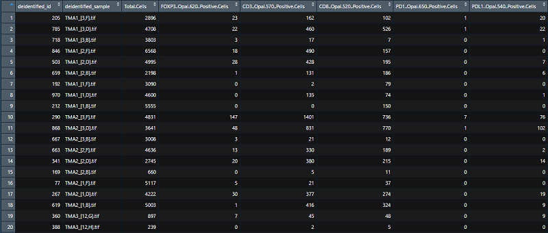
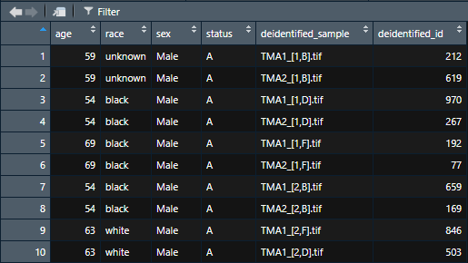
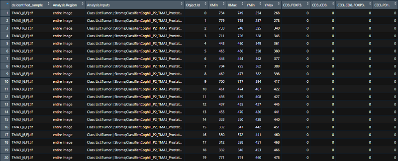

### Input Files

iTIME accepts 3 files as input: a summary, clinical, and spatial file. All files should be csv files. The summary file should contain summary level statistics and should contain one row per sample, while the clinical data file should contain one row per patient. Both the clinical and summary files should contain a variable to link sample IDs and clinical IDs ('Merge Variable'), though the variables do not need to be named the same in both datasets. iTIME does not need to have a spatial data file if only univariate or multivariate summaries are of interest, however, for the spatial data tab clinical and summary data are needed. 

### Summary Pages

#### Univariate Summary

This page provides a summary of the marker chosen from the dropdown menu below and allows users to plot a marker against clinical variables and select the appropriate plot type. Plot types available are Boxplot, Violin plot, Histogram, and Scatter Plot, all of which have the clinical variable along the x-axis. The Boxplot, Violin plot, and Histogram are only applicable for categorical clinical features, while the scatter plot is only applicable for continuous clinical features. The red dashed line in each of these plots correspond to the selected percent threshold. Below the graph there is the ability to download the plot in PDF format for editing. Additional summary tables are provided: a Contingency Table threshold can be set to compute greater than or less than by the clinical variable selected, a Frequency Table displaying the number of samples greater than various thresholds and without stratification, and a Summary Table for all levels of the selected clinical variable.

The lower half of the page provides a beta binomial modeling for the above selected clinical variable and marker. The Cumulative Distribution Function (CDF) plot shows how well the beta binomial fits the selected data relying on the number of positive as the successes and the column "Total Cells". The CD plot shows how many rows in the *summary* file contain a specific number of cells or fewer. For example in the example data when selecting "Percent CD8 (Opal 520) Positive Cells" for the marker to plot and using race as the clinical variable, about 90% of the cores in the *summary* file contain 200 CD8 positive cells or fewer. The beta binomial will likely fit the true (solid black line) distribution best unless there are a high number of zeros in the data, in which case a more appropriate model would be a zero-inflated. In order to appropriately interpret the *Model Statistics*, the column of the summary file that contains the count of total cells per core must be selected. In addition, it's possible to select a reference level of the clinical variable to which the description below it will change.

Currently, there is the ability to apply a **square root**, **Log2**, and **logit** transformations for the summary plots (**log2** and **logit** transformations contain a small addition to all values to prevent infinite values). The transformation is only applied to the data for visualization purposes and not when fitting the beta binomial model.

At the bottom of the page is the ability to download the **Univariate** report in PDF format, which includes all of the information on the page, as well as the ability to add the R code that was used to produce each part of the report.

#### Multivariate Summary

The data are displayed as a heatmap of the selected markers (rows). These data rows have the ability to be clustered through the toggle, where the columns (clinical variable) has the ability to be grouped together based on clinical variable annotation. The order of the samples (columns) and markers (rows) of the heatmap are determined by hierarchical clustering which assigns clusters based on ‘complete’ dissimilarity. Complete dissimilarity refers to the distance of two clusters being determined by the largest distance between elements in either cluster.  The dataset will be sorted by the selected clinical variable to allow for a heatmap where the samples with the same class of a clinical variable are grouped together or appear in increasing order for continuous variables (such as age). Markers to include in the plot are selected through toggling the check-box next to the marker name. In addition to the heatmap, a Principal Component Analysis (PCA) plot is also displayed for the selected clinical variable using the selected markers.

### Spatial Page

The spatial page plots the individual cells by positivity for the markers and plots Ripley's K estimates over a range of r values using default 100 simulated point patterns.

The bottom panel is a plot of a selected measure of spatial clustering. Ripley’s K, Besag’s L, and Marcon’s M quantify the of the degree of spatial clustering for a particular cell type.  These quantities assume that the point process of interest follows complete spatial randomness (CSR) that is that the location of the cells do not form clusters nor do they occur in a regular pattern. Each measure is computed by counting the number of neighboring cells for each cell, where two cells are said to be neighboring if they are within a specified distance, r as seen in the x-axis of ‘Plot of Spatial Clustering Estimator’, of each other. 

Edge corrections are needed for these methods to account for the fact that these cell types are assumed occur outside of the TMA at the same rate. The edge corrections inflate the number of neighboring cells based on their proximity to the edge. Two popular methods edge corrections are isotropic and translational. Translation edge correction translates the region of interest based on the distance between two points and then measures the area of the intersection of the original region and translated region. An isotropic edge correction weights each pair of points based on how much of the circumference of a circle centered around one point and going through the other is outside of the region of interest.

Ripley's $K$ is the basis for Besag's $L$ and Marcon's $M$ and is computed by
$$
\hat{K}\left(r\right) = (n(n-1))^{-1}A \sum^{n}_{i=1} \sum_{j\neq i}w_{ij}|(x_j:d(x_i,x_j)\lt r)|,
$$

where $n$ is the number of cells, $A$ is the area of the TMA, $d(x_i,x_j)$ is the distance between the $i^{th}$ and $j^{th}$ cell, and $w_{ij}$ is weighting factor from the edge correction. The expected value of $K$ under the CSR is $\pi r^2$. Both Besag's L and Marcon's $M$ are different standardizations to Ripley's $K$, which are computed by:

* $L\left(r\right) = \sqrt{K\left(r\right)/\pi}$ and has 
  + Expected value of $L\left(r\right)$ of $r$. Note that the expected value of $L$ grows proportionally with $r$.
* $M\left(r\right) = K\left(r\right)/(\pi r^2)$
  + Expected value of $M\left(r\right)$ is 1. Note that the expected value not a function of $r$.

Neither Ripley's $K$ nor Besag's $L$ involve a comparison to the null case of complete spatial randomness. By subtracting their respective expected values i.e. $H\left(r\right)  = K\left(r\right) -\pi r^2$ and $H^*\left(r\right)  = L\left(r\right)  - r$, $H\left(r\right)$ and $H^*\left(r\right)$ can both be interpreted as a measure of the degree of spatial clustering. Notice that $M\left(r\right)$ is a measure of the degree of spatial clusetering since it is the ratio Ripley's K and it's expected value.  

<!-- ```{r, modified_ripleys, echo=F, fig.align='center'} -->

<!-- tbl = data.frame("Metric" = c("Besag's L","Marcon's M"), -->
<!--                  "Formula" = c("$L\\left(r\\right) = \\sqrt{K\\left(r\\right)/\\pi}$", "$M\\left(r\\right) = K\\left(r\\right)/(\\pi r^2)$"), -->
<!--                  "Expected Value" = c("$r$", "1"), -->
<!--                  "Formula Displayed in Plot" = c("$L\\left(r\\right) - r$","$M\\left(r\\right)$")) -->

<!-- colnames(tbl) = c("Metric","Formula","Expected Value","Formula Displayed in Plot") -->
<!-- knitr::kable( tbl, escape = F, align = 'c', format = 'html')  %>% -->
<!--   kableExtra::kable_styling(position = "center", protect_latex = FALSE, latex_options = 'basic') -->
<!-- ``` -->

<br/>
$H\left(r\right)$ and $H^*\left(r\right)$ Interpretation: If value is larger than 0, than there is evidence of spatial clustering.

Marcon's $M$ Interpretation: If value is larger than 1, than there is evidence of spatial clustering. Additionally, $M\left(r\right)$ is 1.50 at some chosen radius means you're observing 50% more clustering than Poisson distribution would predict.

Nearest neighbor function $G$ provides information about the cumulative distribution function with $G\left(r\right)$. This computes the probability that a cell is present at distance $r$ from an anchor cell by permuting the average number of cells at $r$. Two edge correction methods are applied: reduced sampling which is analogous to border correction of the Ripley's $K$ and Hanish which ignores cells whose $k^{th}$ nierest neighbor is not in the core. The interpretation of the degree of clustering is a proportion of cells are within $r$ distance from other cells, with the observed above theoretical CSR meaning that there is clustering while below theoretical CSR is means the selected cell type is characterized as dispersed at distance $r$. The nearest neighbor distance of $x$ is calculated by $d_i = min_{j \neq i} || x_j - x_i||$ for point pattern $\pmb x$.

### Summary File



### Clinical File



### Spatial File



### Help

**If you have any questions or comments, we would love to hear them. You can email us at [Fridley.Lab@moffitt.org](mailto:Fridley.Lab@moffitt.org) or feel free to [open an issue](https://github.com/FridleyLab/iTIME/issues) in our github page.**
